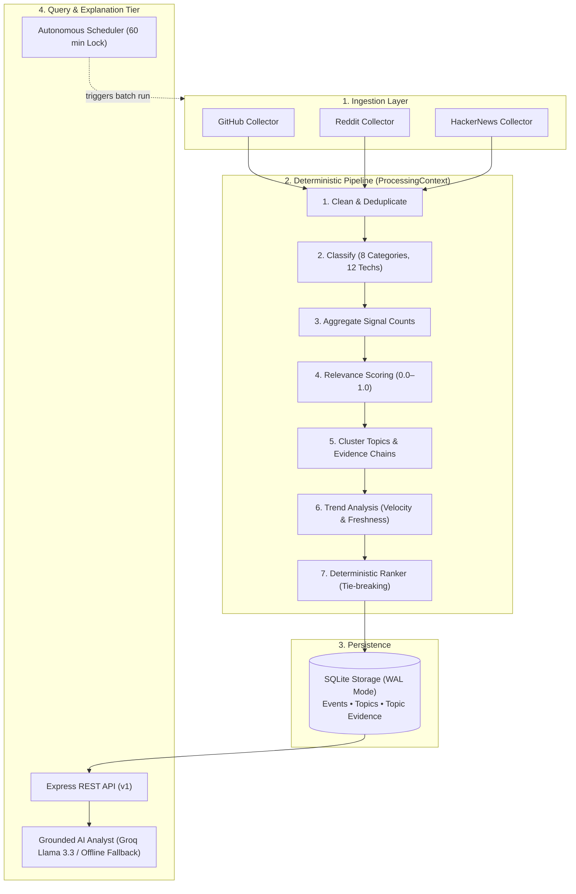

# Startup Radar Engine

> **Early technology & AI opportunity radar for technical founders, indie hackers, and product teams.**
>
> An autonomous intelligence engine that tracks developer signals across GitHub, Reddit, and HackerNews, processes them through a deterministic pipeline to detect emerging technical momentum, and generates grounded market briefings via an AI analyst layer.

[](https://nodejs.org/)
[](https://www.typescriptlang.org/)
[]()
[]()
[-003B57?style=flat-square&logo=sqlite&logoColor=white)](https://www.sqlite.org/)

[Architecture](#architecture) • [Quick Start](#quick-start) • [API Reference](#api-reference) • [Project Structure](#project-structure) • [Roadmap](#roadmap)

---

## Architecture

The system enforces a strict architectural boundary: **all data processing up to ranking is 100% deterministic**. Given the exact same raw signals, the pipeline always produces identical scores, ranks, and topic clusters. 

The **AI Analyst** operates strictly as an explanation tier above the deterministic core. It receives structured intelligence (topics, momentum metrics, evidence keys) and interprets them into executive summaries, but has zero authority to alter canonical scores, fabricate facts, or access persistence directly.



---

## Quick Start

### Prerequisites
* Node.js ≥ 22.0.0
* npm ≥ 10.0.0

### Installation & Run

```bash
# 1. Clone the repository
git clone https://github.com/Harshkatare/startup-radar-engine.git
cd startup-radar-engine

# 2. Install dependencies
npm install

# 3. Build TypeScript
npm run build

# 4. Start the server (default: port 3000)
npm start
```

On first startup, the server automatically initializes `startup-radar.db` (SQLite in WAL mode) and activates the background scheduler.

### Smoke Test Verification

Verify engine liveness and trigger a pipeline processing run:

```bash
# Liveness health check
curl -s http://localhost:3000/health

# Trigger an immediate pipeline batch (HTTP 409 if already executing)
curl -s -X POST http://localhost:3000/process

# Query scheduler status and last execution duration
curl -s http://localhost:3000/process/status

# Retrieve top trending technology topics
curl -s http://localhost:3000/topics/trending
```

### Environment Configuration

Configuration is loaded automatically from environment variables or a local `.env` file:

| Variable | Required | Default | Description |
|:---|:---:|:---|:---|
| `PORT` | No | `3000` | HTTP server listening port |
| `GROQ_API_KEY` | No | *(None)* | Groq API key for LLM-powered topic explanations |
| `GROQ_MODEL` | No | `llama-3.3-70b-versatile` | Groq model identifier for AI Analyst |

> **Offline Mode:** If `GROQ_API_KEY` is not provided, the engine automatically falls back to an offline deterministic analyst that returns structured analytical summaries without making external LLM calls.

---

## API Reference

### 1. Topic Intelligence Endpoints
Core endpoints for querying technology trends, clustered topics, and AI-generated explanations.

| Method | Endpoint | Query Parameters | Description |
|:---|:---|:---|:---|
| `GET` | `/topics` | `limit`, `offset`, `minScore` | Paginated listing of topics ordered by score |
| `GET` | `/topics/trending` | `limit` *(default: 10, max: 100)* | Fast query for highest-velocity emerging topics |
| `GET` | `/topics/:id` | — | Full topic detail with supporting evidence and trend metrics |
| `GET` | `/topics/:id/analysis` | — | Grounded executive briefing generated by the AI Analyst |

#### Example: AI Analyst Topic Briefing (`GET /topics/:id/analysis`)

```json
{
  "topicId": "topic-3691924559",
  "summary": "Accelerating developer activity around vector search and local embeddings.",
  "whyItMatters": "High momentum with 1.0 growth rate and 0.90 confidence across GitHub and Reddit.",
  "evidenceSummary": "Supported by 4 multi-platform signals with strong 14-day recency."
}
```

### 2. Events, Processing & Dashboard Endpoints
Endpoints for raw event filtering, batch pipeline control, and high-level distribution statistics.

| Method | Endpoint | Description |
|:---|:---|:---|
| `GET` | `/health` | Server liveness check |
| `GET` | `/events` | List events with filtering (`source`, `category`, `technology`, `keyword`, `fromDate`, `toDate`, `sortBy`, `sortOrder`, `limit`, `offset`) |
| `GET` | `/events/:id` | Retrieve single raw event by ID |
| `POST` | `/process` | Trigger manual pipeline run (returns 409 if run lock is active) |
| `GET` | `/process/status` | Current scheduler lock state, duration, and last run timestamp |
| `GET` | `/dashboard/summary` | Global counts: total events, sources, categories, technologies, average score |
| `GET` | `/dashboard/categories` | Event distribution breakdown across 8 classified categories |
| `GET` | `/dashboard/technologies` | Event distribution breakdown across 12 tracked technologies |
| `GET` | `/dashboard/top-startups` | Top scoring entities (`?limit=`, clamped 1–100) |

---

## Project Structure

```text
src/
├── analysis/        AI Analyst contracts, Groq provider, fallback provider, and output validator
├── api/             Express application factory and HTTP server entry point
├── bootstrap/       Composition root and dependency injection wiring
├── collectors/      Collector pipeline and GitHub / Reddit / HackerNews source implementations
├── config/          Centralized configuration constants (scoring weights, trend windows, LLM)
├── controllers/     Thin HTTP controllers with strict parameter validation
├── interfaces/      Repository, pipeline, query service, and analyst domain contracts
├── middleware/      Not-found (404) and centralized error-handling (500) middleware
├── processing/      Deterministic pipeline stages: clean, classify, aggregate, score, topics, trends, rank
├── query/           Parameterized read-only query services (SQLiteQueryService, SQLiteTopicQueryService)
├── routes/          Modular Express route definitions
├── scheduler/       Background processing scheduler with single-execution run lock
├── services/        Domain orchestrators: ProcessingService, DashboardService, TopicPersistenceService
├── storage/         SQLite client, schema definitions, and transactional persistence
└── types/           Core domain models, schemas, and enum definitions

tests/
├── unit/            Deterministic unit tests (algorithms, scoring, rankers, validator)
├── integration/     Database integration tests with isolated in-memory SQLite instances
├── api/             Full HTTP route and supertest integration tests
└── e2e/             Complete ingestion-to-intelligence end-to-end scenarios
```

---

## Testing & Quality Gates

The engine enforces automated test coverage across all layers with strict environment isolation:

```bash
npm test                  # Run complete test suite (208 tests, 18 test files)
npm run test:unit         # Unit tests (builders, rankers, trend math, validation)
npm run test:integration  # Integration tests (SQLite queries, persistence, transactions)
npm run test:api          # API endpoint tests (Express controllers, parameter bounds)
npm run test:e2e          # End-to-end full pipeline tests
```

### Static Type Safety & Build
```bash
npx tsc --noEmit          # Strict TypeScript compiler check (0 errors required)
npm run build             # Clean compilation into dist/
```

---

## Tech Stack

| Layer | Technology | Version | Purpose |
|:---|:---|:---:|:---|
| **Runtime** | Node.js | ≥ 22 | Server environment with native fetch and ESM support |
| **Language** | TypeScript | 7.0.2 | Strict static typing and structural interfaces |
| **Framework** | Express | 5.2.1 | Lightweight, unopinionated HTTP routing layer |
| **Database** | better-sqlite3 | 13.0.3 | Synchronous, high-performance SQLite engine in WAL mode |
| **AI / LLM** | groq-sdk | 1.6.0 | Ultra-fast inference provider for grounded topic briefings |
| **Test Suite** | Vitest | 4.1.10 | Fast multi-threaded test execution with environment isolation |
| **API Testing** | Supertest | 7.2.2 | Programmatic HTTP integration assertions |

---

## Current Limitations

To maintain engineering transparency, the following areas represent current architectural boundaries:

* **Collectors return mock signals:** Live external HTTP fetching from GitHub/Reddit/HackerNews APIs is scheduled for Milestone 5 (`v1.0.0`).
* **Global Classification Vocabulary:** Classification runs against the contextual batch vocabulary (`__global__`) rather than per-event NLP tagging.
* **In-Context Rankings:** Topic rankings are computed and tie-broken in-context during pipeline processing; persistence stores scores and trend metrics, with `rank` returning `null` in current query summaries.
* **Authentication:** API endpoints currently operate without authentication tokens.

---

## Release Roadmap

- [x] **v0.1.0 — Core Foundation:** Ingestion collectors, deterministic cleaning, classification, scoring, SQLite persistence, and scheduler.
- [x] **v0.2.0 — Topic Intelligence Engine:** Keyword-driven clustering, 14-day trend momentum, deterministic ranking, and topic query endpoints.
- [x] **v0.3.0 — Grounded AI Analyst:** Groq Llama 3.3 explanation layer, provider abstraction, facts vs interpretation prompt separation, anti-hallucination validation.
- [ ] **v0.4.0 — Product Experience:** Real-time web dashboard, interactive trend visualization, and analyst briefing feed.
- [ ] **v1.0.0 — Production Hardening:** Live external API ingestion, rate limiting, token authentication, and distributed worker execution.

---

## License

All rights reserved.